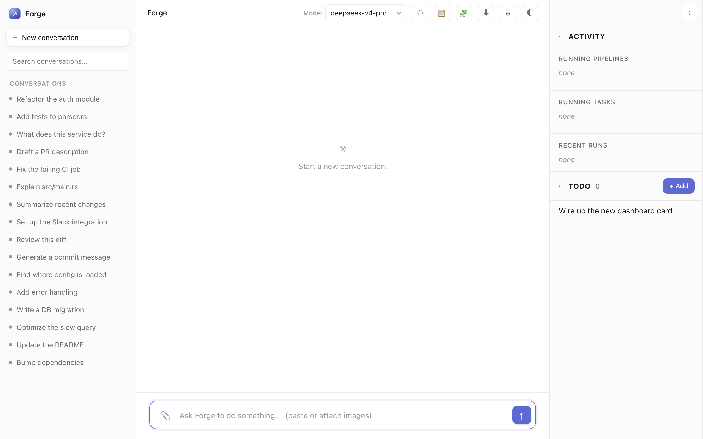
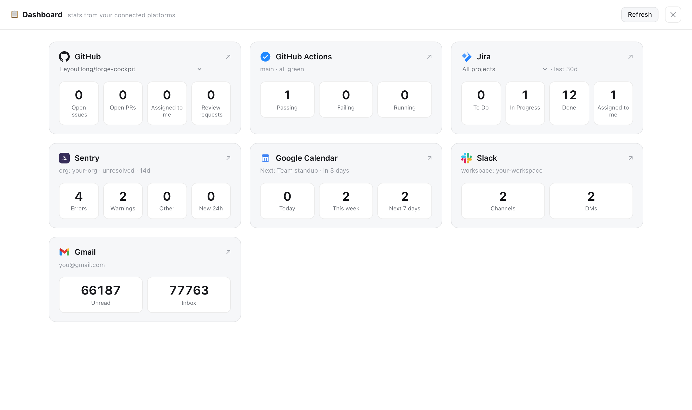
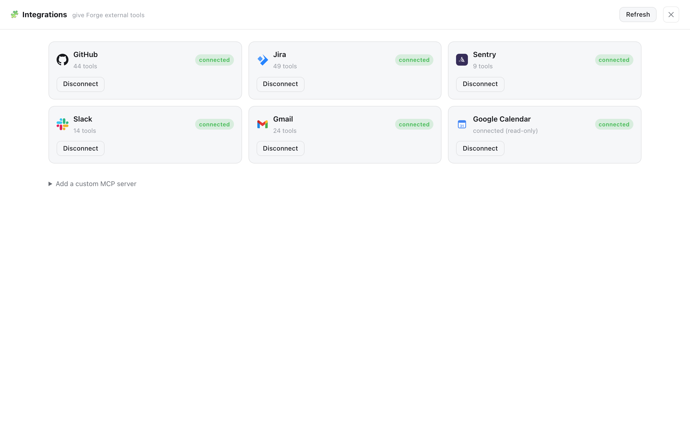
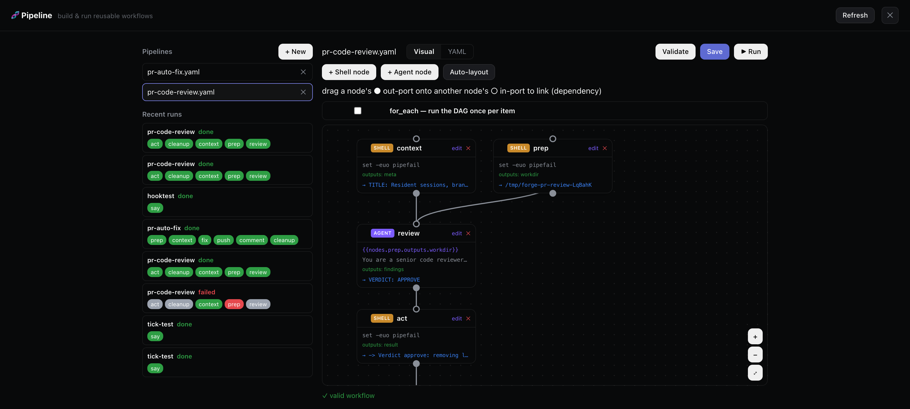
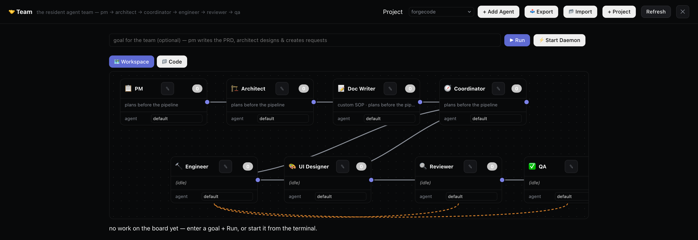
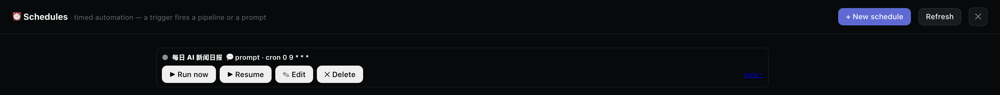
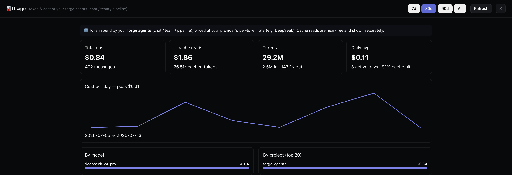
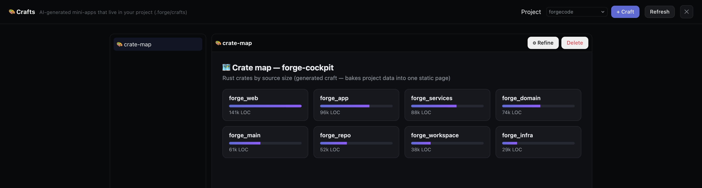

<h1 align="center">⚒️ forge-cockpit</h1>

<p align="center">An AI coding agent with a <strong>browser cockpit</strong> — the same agent you drive from the terminal, plus platform dashboards and one-click integrations. Bring your own model API key.</p>

<p align="center">
  <a href="https://github.com/LeyouHong/forge-cockpit/actions"></a>
  <a href="LICENSE"></a>
  <a href="https://www.npmjs.com/package/forge-cockpit"></a>
</p>

---

`forge-cockpit` is an autonomous coding agent: you give it a task in plain language and it reads your code, edits files, runs commands, searches the web, and drives external platforms (GitHub, Jira, Slack, Gmail…) to get it done — like a pair-programmer that can actually act.

It runs two ways from one engine:

- **Terminal** — an interactive TUI, one-shot commands, or a `:` shell plugin.
- **Browser cockpit** — `forge-cockpit serve` opens a local web UI with streaming chat, read-only **dashboards** over your connected platforms, and **one-click integrations**. This is what the *cockpit* is.

> **Built on [Forge](https://github.com/antinomyhq/forge) (Apache-2.0).** This is an independent fork focused on the browser cockpit and a **bring-your-own-key** model — no hosted account required. See [Credits](#credits).

<p align="center"></p>

## Table of contents

- [What's different in this fork](#whats-different-in-this-fork)
- [Install](#install)
- [Quickstart (bring your own key)](#quickstart-bring-your-own-key)
- [The Web Cockpit](#the-web-cockpit)
- [Terminal usage](#terminal-usage)
- [Integrations (MCP)](#integrations-mcp)
- [Configuration](#configuration)
- [Build from source](#build-from-source)
- [Architecture](#architecture)
- [Credits](#credits)
- [License](#license)

## What's different in this fork

| | Upstream Forge | forge-cockpit |
|---|---|---|
| Model access | Hosted forgecode aggregator (default) | **Bring your own key** (OpenAI / Anthropic / OpenRouter / … ) — the hosted aggregator is removed from the provider list |
| Browser UI | — | **Web cockpit**: chat + dashboards + one-click integrations |
| Platform dashboards | — | GitHub · GitHub Actions · Jira · Sentry · Google Calendar · Slack · Gmail |
| One-click integrations | — | Slack (bot token), Gmail (app password), plus GitHub/Jira/Sentry/Calendar and any custom MCP |
| Orchestration | — | **Pipelines** (visual DAG workflows, agent-invokable) · **Team** (editable multi-agent canvas) · **Schedules** (cron + actions) · **Usage** analytics · **Crafts** (AI-generated mini-apps) |
| Distribution | — | Published to npm (`npx forge-cockpit`) with prebuilt binaries per platform |

The underlying agent engine, tools, and provider support are inherited from Forge.

## Install

```bash
npm install -g forge-cockpit     # or run once with: npx forge-cockpit
```

On install, the right prebuilt binary for your platform (macOS arm64, Linux x64/arm64, Windows x64) is downloaded from the matching GitHub Release — nothing is compiled on your machine. Prefer building yourself, or on an Intel Mac? See [Build from source](#build-from-source).

> On Linux the prebuilt binaries need glibc ≥ 2.35 (Ubuntu 22.04+, Debian 12+); on older distros, [build from source](#build-from-source). The binary also dynamically links OpenSSL (`libssl`) for IMAP email support; install `libssl3` if it's missing (present on virtually all modern distros).

## Quickstart (bring your own key)

```bash
# 1. Log in with YOUR provider key (OpenAI / Anthropic / OpenRouter / …)
forge-cockpit provider login

# 2. Drive the agent in your terminal
forge-cockpit                         # interactive session
forge-cockpit -p "explain src/main.rs"  # one-shot

# 3. …or open the browser cockpit
forge-cockpit serve
```

No hosted account is bundled or required — on first run you configure your own provider.

## The Web Cockpit

```bash
forge-cockpit serve                 # opens your browser
forge-cockpit serve --port 8080     # pick a port
forge-cockpit serve --no-open       # don't auto-open
```

It prints a loopback URL carrying a per-run token:

```
Forge web UI ready. Open:
  http://127.0.0.1:8080/?token=<uuid>
```

> **Security:** the server binds to `127.0.0.1` and every `/api/*` route is gated by that random, per-run token. Anyone with the URL can run commands and edit files as you — keep it private; it's valid only for that session.

**What's inside:**

- **💬 Chat** — the full agent in a browser: streaming responses, collapsible reasoning / tool-call chips, image paste. Turns are **resumable**, so refreshing mid-run re-attaches to the agent's progress instead of losing it.

- **📋 Dashboard** — read-only KPI boards fetched directly from each connected platform's API:

  | Platform | At a glance |
  |---|---|
  | **GitHub** | open issues / PRs / assigned-to-me / review-requested — *repo pickable* |
  | **GitHub Actions** | latest run status on the default branch |
  | **Jira** | To Do / In Progress / Done / assigned-to-me — *project pickable* |
  | **Sentry** | unresolved errors / warnings / new in 24h |
  | **Google Calendar** | today / this week / next 7 days |
  | **Slack** | channels / DMs |
  | **Gmail** | unread / inbox total |

  <p align="center"></p>

- **🧩 Integrations** — one-click connect to MCP servers so the agent can *act* on those platforms (read **and** write). Built-in cards for GitHub, Jira, Sentry, **Slack** (bot token), **Gmail** (app password), Google Calendar, plus any custom stdio/HTTP MCP server. Connecting writes an entry to `~/forge/.mcp.json` and reloads MCP live.

  <p align="center"></p>

- **⏱ Activity & TODO** — running turns, recent runs, and a small personal TODO list the agent can pick up.

### Orchestration & automation

Beyond chat, the cockpit ships a full orchestration stack — build reusable agent workflows, run a resident multi-agent team, schedule work, and watch what it costs:

- **🧬 Pipelines** — YAML DAG workflows (agent + shell nodes) with a **visual drag-and-drop builder**. Nodes pass outputs downstream (`{{nodes.x.outputs.y}}`), run in parallel, support `for_each` batching and verify/replan self-healing. Pipelines are global, reusable recipes; ▶ Run picks a target directory and fills the declared inputs. The chat agent can **discover and run them itself** (`pipeline_list` / `pipeline_run`) — "review this PR" routes through your pr-review pipeline instead of doing it by hand. Ships example workflows for PR review + auto-fix.

  <p align="center"></p>

- **🤝 Team** — a resident multi-agent team on an **editable canvas**. Members (PM · Architect · Coordinator · Engineer · Reviewer · QA, or your own) carry a stage, a custom SOP, a per-role model, and DAG connections you draw by dragging. Give it a goal → PM writes a PRD → Architect designs and files work requests → engineers implement → reviewer → QA, handed off automatically through a request/response state machine with a message bus. Includes Lead gap-coverage, per-item human **approval gates**, member templates, whole-team YAML import/export, resident per-member sessions (persistent memory), and a **Code** tab to browse the project (git-modified files marked, per-file diff).

  <p align="center"></p>

  Every member runs as a **resident terminal**: a persistent tmux session with an interactive CLI agent — **Claude Code by default, on its own subscription login, no provider API key**. The orchestrator drives it the way a human would (pastes the prompt, watches the board), and the session keeps its memory across tasks via `--resume`. Click ⌨ on a live member's card to open its **terminal right in the cockpit** (xterm.js over WebSocket) — watch the agent work or take over and type, from any browser; closing the pane detaches without disturbing the member. `tmux attach -t forge-team-<id>` works locally too. Requires `tmux` and the CLI agent installed and logged in — the team runs entirely on the CLI's subscription auth; no provider API key is spent on team work.

  Every member card has a **⏸/▶ pause toggle** (also `forge-workspace pause|resume <member>`): a paused member finishes its current work but takes nothing new — requests for its stage wait rather than being rerouted or Lead-covered, and pause survives orchestrator restarts. Handy for taking over a resident terminal without the orchestrator injecting the next prompt mid-conversation.

  **Watches** (👁 on the Team page) keep an idle team reactive: monitor a directory (with a `*.ext` filter), the git state (HEAD + working tree), or any shell command's output — on change, either a request lands on the board (the team analyzes/handles it autonomously, with an optional *brief* telling it what to do) or a ticket alerts the human inbox. The first look only sets a baseline, and state survives orchestrator restarts.

- **⏰ Schedules** — timed automation: a **trigger** (every N min / cron / once / manual) fires a **body** (a saved pipeline, or a one-shot agent prompt), then an optional **action** delivers the output (webhook/Slack or email). Run history with cleaned output tails.

  <p align="center"></p>

- **📊 Usage** — token & cost of your forge agents (chat / team / pipeline), scanned from the conversation store and priced at your provider's rate (DeepSeek, Claude, …). Summary cards, daily trend, by-model / by-project breakdowns.

  <p align="center"></p>

- **🎨 Crafts** — project-scoped mini-apps. Describe what you want ("a dashboard of our REST endpoints") and a background builder agent reads your project and writes a self-contained HTML page under `<project>/.forge/crafts/`, rendered in a sandboxed iframe tab. Refine it in place; commit it so the team gets the same tab.

  <p align="center"></p>

## Terminal usage

Three modes:

```bash
forge-cockpit                        # interactive TUI (multi-step work)
forge-cockpit -p "add tests to lib.rs"   # one-shot; also: echo "..." | forge-cockpit
forge-cockpit setup                  # install the ZSH `:` plugin, then use `:` at your prompt
```

A few of the most useful in-session `:` commands (full engine command set inherited from Forge):

| Command | Does |
|---|---|
| `:new` / `:conversation` | new / switch conversation |
| `:model <id>` | set the model for this session |
| `:agent <name>` · `:plan` · `:ask` | switch agent / planning / Q&A |
| `:commit` | AI-generated git commit |
| `:sync` | index the codebase for semantic search |
| `:tools` · `:skill` · `:info` | list tools / skills / session info |

## Integrations (MCP)

The agent gains external capabilities via **MCP** servers. Connect them from the 🧩 cockpit page, or on the CLI:

```bash
forge-cockpit mcp list      # list servers
forge-cockpit mcp import    # import from JSON
forge-cockpit mcp reload    # reconnect + rebuild caches
```

Or edit `.mcp.json` directly (project-local `<project>/.mcp.json` overrides global `~/forge/.mcp.json`):

```json
{
  "mcpServers": {
    "slack": {
      "command": "npx",
      "args": ["-y", "slack-mcp-server@latest", "--transport", "stdio"],
      "env": { "SLACK_MCP_XOXB_TOKEN": "xoxb-…" }
    },
    "github": {
      "url": "https://api.githubcopilot.com/mcp/",
      "headers": { "Authorization": "Bearer ghp_…" }
    }
  }
}
```

## Configuration

| File | What it holds |
|---|---|
| `~/.forge.toml` (global config) | default model, provider credentials, temperature, retries |
| `~/forge/.mcp.json` · `<project>/.mcp.json` | MCP servers (project overrides global) |
| `AGENTS.md` (project root or `~/forge/`) | persistent instructions for every agent — conventions, commit style, things to avoid |
| `.forge/commands/*.md` | reusable custom commands |
| `~/.forge-web.json` | cockpit settings: TODOs, calendar URL, repo/project pins |

Fine-tuning via env vars (retries, HTTP/TLS timeouts, etc.) is inherited from the engine — e.g. `FORGE_RETRY_MAX_ATTEMPTS`, `FORGE_HTTP_READ_TIMEOUT`, `FORGE_HTTP_TLS_BACKEND`.

## Build from source

Requires a recent Rust toolchain.

```bash
git clone https://github.com/LeyouHong/forge-cockpit
cd forge-cockpit
cargo build --release -p forge_main   # produces ./target/release/forge
```

A source build names the binary `forge`; the npm package names it `forge-cockpit` to avoid clashing with an existing install.

## Architecture

forge-cockpit is a Cargo workspace of ~25 crates in a layered (hexagonal) design: a pure-types core (`forge_domain`), an orchestrator that runs the agent loop (`forge_app/orch.rs`), service + infrastructure layers, a single API facade (`forge_api`), and two frontends (`forge_main` TUI, `forge_web` cockpit).

> A full **hand-holding architecture guide** — the agent loop, tools, providers, MCP, and how to extend the web cockpit — is written up in a companion PDF (`forge-framework-guide.pdf`, generated locally; not committed).

## Credits

Built on **[Forge](https://github.com/antinomyhq/forge)** by Antinomy / forgecode.dev, used under the Apache-2.0 license. The core agent engine, tools, and provider integrations are their work. This fork adds the browser cockpit, the bring-your-own-key defaults, and npm distribution. "Forge" and "forgecode" are trademarks of their respective owners; this project is not affiliated with or endorsed by them.

## License

[Apache-2.0](LICENSE) — same as upstream. See the `LICENSE` file for the full text.
